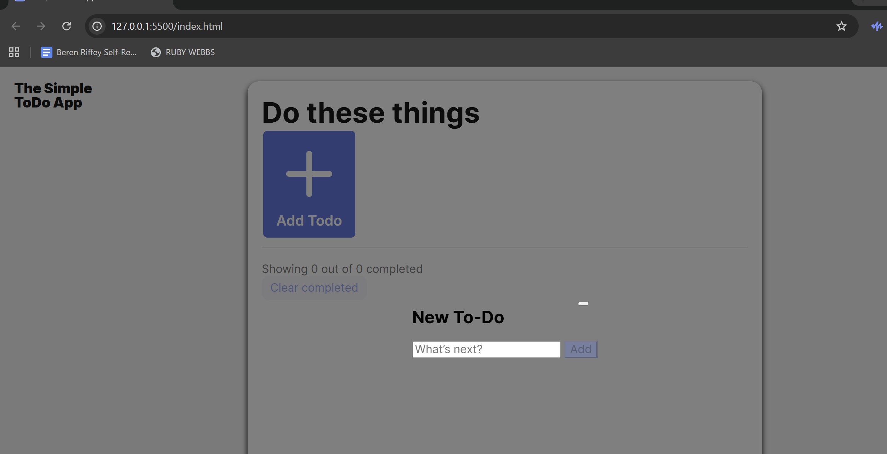

🪄 Dynamic To-Do App

Overview

This project is a responsive, interactive To-Do List application built with JavaScript (OOP), HTML, and CSS. It allows users to create, manage, and persist their task lists using localStorage.
The app demonstrates modular, component-based design, DOM manipulation, and smooth UX behaviors such as animated deletions and dynamic datalist suggestions.

🌷❀───────────────────────────────❀🌷

✨ Features

Add New Tasks via a popup form

Automatic Persistence of todos in localStorage

Dynamic <datalist> for quick access to recently used task labels

Completion Counter that updates in real-time

Clear Completed Tasks button (activates only when needed)

Animated Delete Transitions for a polished user experience

Form Validation and accessibility features

Responsive Layout optimized for both desktop and mobile

🌷❀───────────────────────────────❀🌷

🧩 Project Structure
/pages
index.js → main entry script
/components
Section.js → handles rendering and updating list sections
Todo.js → represents individual todo items
TodoCounter.js → updates task count dynamically
PopupWithForm.js → manages popup open/close and submission
FormValidator.js → handles form input validation
/blocks
(BEM-structured CSS for styling)

🌷❀───────────────────────────────❀🌷

🌿 Technologies Used

HTML5

CSS3 (BEM Methodology)

Vanilla JavaScript (ES6 Modules)

LocalStorage API for data persistence

DOM Manipulation & Event Handling

🌷❀───────────────────────────────❀🌷

⚙️ Setup Instructions

Clone the repository:

git clone <your-repo-link>

Open the project folder in your IDE.

Start a local server (e.g., VS Code → “Live Server” extension).

Add, check off, and clear tasks — your list will automatically save between sessions.

🌷❀───────────────────────────────❀🌷

💫 Key Learning Outcomes

Practiced Object-Oriented Programming in JS

Learned to dynamically generate DOM elements and synchronize state

Implemented modular imports/exports

Refined event listener handling and cleanup

Strengthened understanding of localStorage and persistence patterns

Designed responsive, user-friendly UI transitions

🌷❀───────────────────────────────❀🌷

📸 Screenshot

  

<em>Dynamic To-Do App — built with love, logic, and a little bit of magic ✨</em>

🌷❀───────────────────────────────❀🌷

🌼 Deployment

Hosted on GitHub Pages:
👉 Your Project Link Here

🌷❀───────────────────────────────❀🌷

💖 Author

Developed by Beren Riffey as part of the TripleTen Software Engineering Bootcamp.
Guided and refined with the help of my ever-brilliant study partner 💻🌸
