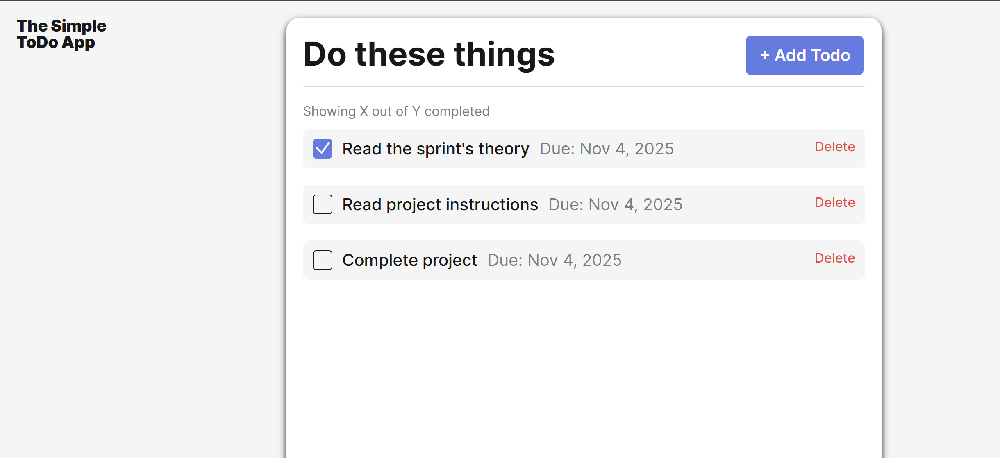

🌸 ─────────────────────────────────────────────── 🌸

  

<h1 align="center">🪄 Simple To-Do App</h1>

<i>Class-based To-Do list with clean BEM styling and a cozy vibe.</i>

  <a href="https://riffey55.github.io/se_project_todo-app/" target="_blank">🌸 <b>Live Demo</b></a>
  &nbsp;•&nbsp; <a href="#-features">✨ Features</a>
  &nbsp;•&nbsp; <a href="#-tech-stack">🛠️ Tech Stack</a>

---

## 💡 Why This Project?

This app was built to strengthen my understanding of **object-oriented programming (OOP)** and **modular JavaScript architecture**.  
It demonstrates how reusable class components—like the `FormValidator` and `Todo` classes—can keep code organized and scalable.  
Beyond functionality, I focused on **clean BEM-based design** and a simple, accessible user experience.

🌸 ─────────────────────────────────────────────── 🌸

## 🪶 Overview

A simple, object-oriented **To-Do List App** built during **TripleTen Sprint 7** to demonstrate modular JavaScript structure and clean BEM-based design.  
Tasks can be added, deleted, and marked as complete—all handled through reusable class components.

---

## 🛠️ Tech Stack

- **HTML5** – semantic structure of the app
- **CSS3 (BEM)** – modular and maintainable styling
- **Vanilla JavaScript (ES6)** – logic and DOM manipulation
- **Git & GitHub** – version control
- **GitHub Pages** – deployment

---

## ✨ Features

✅ Add, delete, and mark tasks as completed  
✅ Form validation via `FormValidator` class  
✅ Modular `Todo` component for better scalability  
✅ UUID-based unique task identifiers  
✅ Clean and responsive interface

---

## 🌐 Live Demo

🔗 [View the live project on GitHub Pages](https://riffey55.github.io/se_project_todo-app/)

---

🔗 [LinkedIn](https://www.linkedin.com/in/berenriffey) • 🐙 [GitHub](https://github.com/riffey55)

🌸 ─────────────────────────────────────────────── 🌸

## 📝 **Recent Updates**

**November 4, 2025**  
**Commit:** `fix: update checkbox icon and refresh project files`

✨ Replaced missing `checkbox.svg` to restore checklist functionality.  
🧹 Removed outdated history files and streamlined repo organization.  
📝 Refreshed `README.md` for clarity and alignment with current project version.  
✅ Verified local functionality before push; repo confirmed production-ready.

🌸 ─────────────────────────────────────────────── 🌸

---

## 💻 Author

**Beren Riffey**  
Created with ❤️ using JavaScript & modular design.
