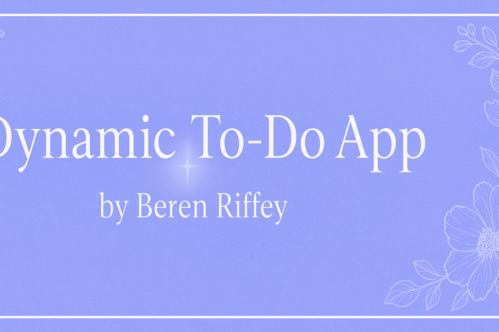
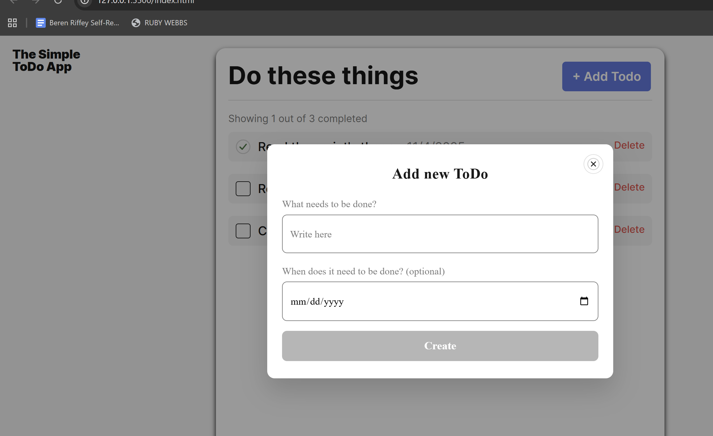

<p align="center">
  
</p>

---

# 🌸 Dynamic To-Do App

A sleek, responsive to-do list app built with **Object-Oriented JavaScript**, featuring modular components, live task counters, and smooth popup forms.  
This project demonstrates DOM manipulation, ES6 imports/exports, and data persistence using the LocalStorage API.

💻✨ Built with love, logic, and a little bit of magic. ✨

🌷❀───────────────────────────────❀🌷

## 🌼 Features

- Add, check off, and delete tasks
- Real-time task counter (completed vs. total)
- Data saved in LocalStorage between sessions
- Responsive layout for desktop and mobile
- Smooth popup animations and form validation

🌷❀───────────────────────────────❀🌷

## 🪴 Project Structure

/pages  
index.js → main entry script

/components  
Section.js → renders and updates todo list  
Popup.js → base popup class for modal logic  
PopupWithForm.js → handles popup open/close and submission  
Todo.js → represents individual todo items  
TodoCounter.js → updates task count dynamically  
FormValidator.js → handles form input validation

/blocks  
(BEM-structured CSS for styling)

🌷❀───────────────────────────────❀🌷

## 💻 Technologies Used

- HTML5
- CSS3 (BEM Methodology)
- Vanilla JavaScript (ES6 Modules)
- LocalStorage API
- DOM Manipulation & Event Handling

🌷❀───────────────────────────────❀🌷

## 🌸 Setup Instructions

1. Clone the repository:

   ```bash

   git clone https://github.com/riffey55/se_project_todo-app.git

   ```

   Open the project folder in your IDE.

Start a local server (e.g., VS Code → “Live Server” extension).

Add, check off, and clear tasks — your list will automatically save between sessions.

🌷❀───────────────────────────────❀🌷

💫 Key Learning Outcomes

- Practiced Object-Oriented Programming in JavaScript

- Learned to dynamically generate DOM elements and synchronize state

- Implemented modular imports/exports

- Refined event listener handling and cleanup

- Strengthened understanding of LocalStorage and persistence patterns

- Designed responsive, user-friendly UI transitions

🌷❀───────────────────────────────❀🌷

📸 Screenshot

<p align="center">  </p> <p align="center"><em>Dynamic To-Do App — built with love, logic, and a little bit of magic ✨</em></p>

🌷❀───────────────────────────────❀🌷

🚀 Deployment

Hosted on GitHub Pages:
👉 👉 [Live Demo on GitHub Pages](https://riffey55.github.io/se_project_todo-app/)

🌷❀───────────────────────────────❀🌷

🌷 Author

Beren Riffey
💻 Steady Light Developer Binder — Projects • Learning • Reflections
🌸 GitHub Profile

<p align="center">🌷💻💞</p> ```
