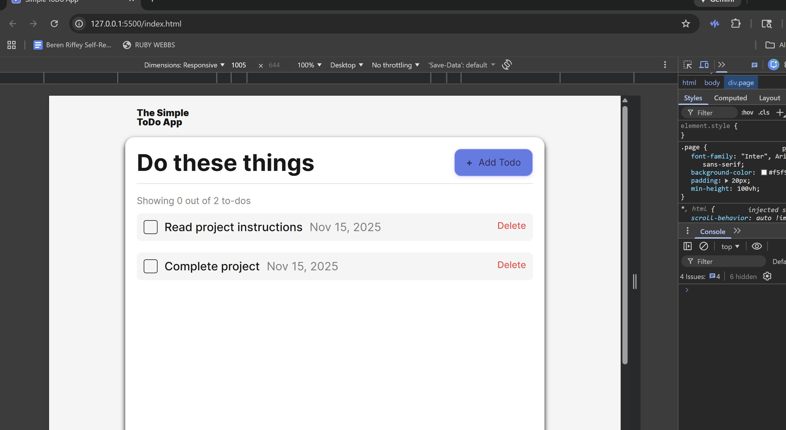
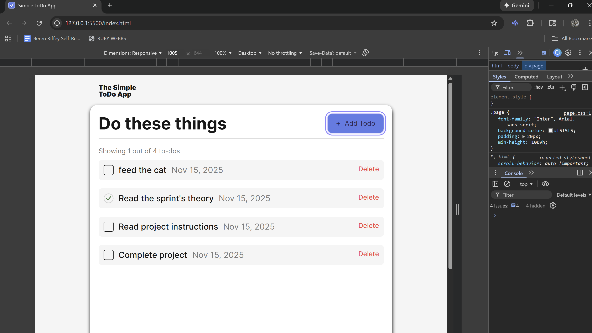

# Reviewer Notes

Hi! Thank you so much for taking the time to review my project.

Your previous feedback was incredibly helpful — clear, actionable, and exactly what I needed to improve this submission. I’ve implemented all requested changes, including:

- Adding and storing the item **ID** consistently in the class constructor
- Ensuring **callbacks** receive complete task data
- Correcting **date normalization** and display (no timezone shift for YYYY-MM-DD)
- Restoring missing assets (checkbox icon)
- Refining the README and repo structure

Everything is tested and functioning correctly both locally and on GitHub Pages. If anything else needs attention, I’m more than happy to make further improvements.

---

## 🧭 How to Run Locally

1. Clone the repo and open the project folder.
2. Serve locally (any static server). Example:
   - VS Code: **Live Server** extension
   - Node: `npx serve` (or `python -m http.server 5500`)
3. Open `http://127.0.0.1:5500/index.html`.

---

## ✅ Test Plan (Manual)

- **Add To-Do**
  - Enter name + date → Click _Add Todo_ → Item appears in the list.
- **Mark Complete / Uncomplete**
  - Toggle checkbox → Visual state updates → Counter recalculates.
- **Delete To-Do**
  - Click _Delete_ → Item is removed → Counter recalculates.
- **Counter Logic**
  - Shows `X out of Y to-dos` with live updates after each action.
- **Date Handling**
  - Input `YYYY-MM-DD` renders as a local date (no off-by-one).
- **Error-Free Console**
  - No red errors during normal usage.

---

## 🧪 Testing Evidence (Console Screens)

Below are console logs and visual confirmations showing the app functions as expected.

### 1) Add & Complete Flow

### 2) Delete & Counter Recalculation

### 3) Full Interaction Pass (No Errors)

> If you prefer, I can provide additional screenshots or a short screen recording demonstrating the full flow end-to-end.

---

## 🧩 Edge Cases & Decisions

- **Date Normalization:**  
  For `YYYY-MM-DD`, the app constructs a Date with local year/month/day to avoid timezone shifts (e.g., preventing Nov 13 → Nov 12).
- **Graceful Defaults:**  
  If a name is missing, it defaults to `""`; completed is coerced to `Boolean(data?.completed)`; unknown dates fall back to `new Date()`.

---

## 🧱 Rubric Alignment (At a Glance)

- **Class-based architecture:** `Todo` and supporting modules organize UI logic and state.
- **Event handling:** Check, delete, and add events update UI + counter in real time.
- **Clean DOM updates:** Items render via templates; handlers attach per instance.
- **Styling & accessibility:** BEM classes and clear focus/hover states.
- **Documentation:** README describes purpose, tech stack, and features; these notes capture testing details.

---

## 🧰 Environment

- **Browser:** Latest Chrome (desktop)
- **Local server:** VS Code Live Server / `npx serve`
- **OS:** Windows 10/11

---

## 🙏 Acknowledgments

Thank you for your thoughtful guidance and detailed feedback — it truly accelerates my learning and helps me grow as a developer. I appreciate the clarity and care you bring to each review.
